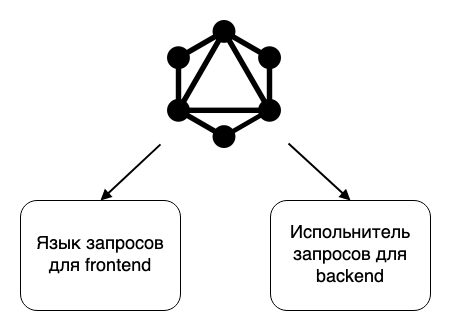

# Демо graphql в django

## Начало работы
1. Устанавливаем Python 2
    ```bash
    # MacOS
    brew install python@2

    # Ubuntu
    apt install python2
    ```
1. Клонируем репозиторий 
    ```bash
    git clone https://github.com/subv13/gql.git /путь/до/проекта
    ```
1. Создаём виртуальные окружение c python 2 
    ```bash
    virtualenv /путь/до/проекта/venv -p python2
   ```
1. Устанавливаем зависимости
    ```bash
    # Python 2
    source venv/bin/activate
    pip install -r requirements.txt 
    ```
1. Устанавливаем хуки гита - запускают линтеры и форматтеры на коммиты.
    ```bash
    pre-commit install
    ```
1. Накатываем миграции
    ```bash
    ./manage.py migrate
    ```
1. Создаём суперпользователя
    ```bash
    ./manage.py createsuperuser
    ```
1. Загружаем фикстуры
    ```bash
     ./manage.py loaddata tablet.json
    ```
1. Запускаем сервер
    ```bash
    ./manage.py runserver
    ```
1. Открываем [GraphiQL](http://127.0.0.1:8000/graphql)

## GraphQL

### Что такое GraphQL


**Материалы**
1. [Официальный гайд о GraphQL](https://graphql.org/learn/)
2. [Спецификация GraphQL](http://spec.graphql.org/June2018/)
3. [Хороший вводный доклад про GraphQL](https://www.youtube.com/watch?v=F4vHSHzpO1g&t=2712s)
4. [Анатомия запроса GraphQL](https://www.apollographql.com/blog/the-anatomy-of-a-graphql-query-6dffa9e9e747/)

### Описание схемы

Основная библиотека для описание схемы GraphQL в python - [graphene](https://docs.graphene-python.org/projects/django/en/latest/tutorial-plain/). Так же есть библиотека для [graphene-django](https://docs.graphene-python.org/projects/django/en/latest/) упрощающая интеграцию с Django

**Материалы**
1. [Общие правила написания схем GraphQL](https://www.youtube.com/watch?v=tASEYJXdO_c)
2. [Репозиторий с правилами из доклада выше](https://github.com/nodkz/graphql-rules-ru/tree/master/docs)
3. [Описание подходов к пагинации](https://www.apollographql.com/blog/understanding-pagination-rest-graphql-and-relay-b10f835549e7/)
4. [Хороший подход к описанию сортировок и фильтров](https://www.youtube.com/watch?v=dDxUu-K2qdE)

#### Правила написания схем GraphQL в python

**Не нужно складывать описание всей схемы в один файл**

Для того чтобы схема не превращалась в файл из тысяч строк лучше разбивать её на пакеты и модули. Например


**Не использовать класс graphene.Mutation**

Описание резолверов выглядит хорошо, а вот описание мутаций выглядит как что-то не из python. Не до конца понятно почему мутации реализовали в таком виде, когда их можно описать как обычные поля и будет намного pythonic. Например


**Документировать сложные части схемы с помощь markdown**

GraphiQl и другие клиенты могут рендерить markdown написанный в `description`. Его можно писать в multiline строках, но важно чтобы не было отступов, поэтому лучше выносить в отдельную константу. Например


## Материалы

### Авторизация
В каждый резолвер и мутацию приходит аргумент info в котором есть context который по сути request из django

Много про авторизацию есть в этом видео [ссылка][11]

### Производительность 
Для сокращения запросов есть история с даталоадерами [ссылка][15], [ссылка][16], [ссылка][17]

Для защиты от сложных запросов есть несколько разных подходов [ссылка][18]

### Elasticsearch
В процессе

### Тесты
Сделано

### Генерация типов для фронтенда
Как генерировать правильно типы для фронтенда для разных релизов, новых веток, etc?

### CI/CD
Репортер схемы в репозиторий схем??? [ссылка][19]

### Метрики
Что делать с newrelic, sentry, etc?

### Обработка ошибок
Как лучше возвращать ошибки? [ссылка][21] [ссылка][22] [ссылка][23]

Ошибки в Apollo Server [ссылка][20]

[1]: https://www.apollographql.com/blog/the-basics-of-graphql-in-5-links-9e1dc4cac055/
[2]: https://www.apollographql.com/blog/graphql-explained-5844742f195e/
[3]: https://www.youtube.com/watch?v=F4vHSHzpO1g
[4]: https://www.apollographql.com/blog/the-anatomy-of-a-graphql-query-6dffa9e9e747/
[5]: https://docs.graphene-python.org/en/latest/types/schema/ 
[6]: https://docs.graphene-python.org/projelcts/django/en/latest/installation/
[7]: https://www.apollographql.com/blog/full-stack-error-handling-with-graphql-apollo-5c12da407210/
[8]: https://github.com/nodkz/graphql-rules-ru/tree/master/docs
[9]: https://www.youtube.com/watch?v=tASEYJXdO_c
[10]: https://www.apollographql.com/blog/explaining-graphql-connections-c48b7c3d6976/
[11]: https://www.youtube.com/watch?v=NnnvOPdstzg&t=1892s
[12]: https://www.apollographql.com/blog/understanding-pagination-rest-graphql-and-relay-b10f835549e7/
[13]: https://github.com/nodkz/graphql-rules-ru/blob/master/docs/05-list/5.4-pagination.md
[14]: https://www.youtube.com/watch?v=dDxUu-K2qdE
[15]: https://www.youtube.com/watch?v=NnnvOPdstzg&t=1892s
[16]: https://apirobot.me/posts/django-graphql-solving-n-1-problem-using-dataloaders
[17]: https://blog.logrocket.com/designing-graphql-server-optimal-performance/
[18]: https://www.apollographql.com/blog/securing-your-graphql-api-from-malicious-queries-16130a324a6b/
[19]: https://www.apollographql.com/blog/track-schema-changes-with-apollo-schema-reporting/
[20]: https://www.apollographql.com/blog/full-stack-error-handling-with-graphql-apollo-5c12da407210/
[21]: https://github.com/nodkz/graphql-rules-ru/blob/master/docs/06-mutations/6.6.4-payload-errors.md
[22]: https://www.facebook.com/MoscowGraphql/videos/206572663566137/
[23]: https://github.com/nodkz/conf-talks/tree/master/articles/graphql/errors